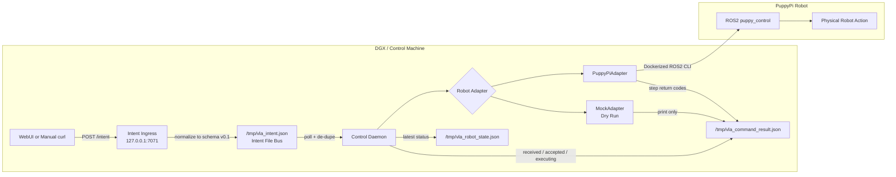

# OpenPAVE Stage 1 Validation Steps

This guide validates the Stage 1 OpenPAVE runtime with a DGX/control machine and a PuppyPi robot.

Stage 1 covers:

- Stage 1A: intent schema v0.1
- Stage 1B: robot adapter boundary
- Stage 1C: command result and robot state feedback

## Stage 1 Flow



The expected runtime path is:

```text
Intent Ingress
-> /tmp/vla_intent.json
-> Control Daemon
-> Robot Adapter
-> ROS2
-> PuppyPi
-> /tmp/vla_command_result.json
-> /tmp/vla_robot_state.json
```

## 0. Prepare the Development Environment

On the DGX/control machine:

```bash
cd /path/to/OpenPAVE
python3 -m venv .venv
source .venv/bin/activate
python3 -m pip install -U pip
python3 -m pip install -r intent-ingress/requirements.txt
```

Run tests:

```bash
python3 -B -m unittest discover
```

Expected:

```text
OK
```

## 1. Start the PuppyPi ROS2 Controller

On the PuppyPi:

```bash
docker start puppypi_ros2
docker exec -it -u ubuntu -w /home/ubuntu puppypi_ros2 /bin/zsh
```

Inside the container:

```bash
export ROS_DOMAIN_ID=0
export RMW_IMPLEMENTATION=rmw_fastrtps_cpp

source /opt/ros/humble/setup.bash
ros2 launch puppy_control puppy_control.launch.py
```

In another PuppyPi terminal, verify the ROS2 node and services:

```bash
docker exec -it -u ubuntu -w /home/ubuntu puppypi_ros2 /bin/zsh
```

Inside the container:

```bash
export ROS_DOMAIN_ID=0
export RMW_IMPLEMENTATION=rmw_fastrtps_cpp

source /opt/ros/humble/setup.bash
ros2 node list | grep -E "^/puppy$" || echo "NO /puppy"
ros2 service list | grep puppy_control
```

## 2. Verify the PuppyPi ROS2 CLI Image

On the DGX/control machine:

```bash
cd /path/to/OpenPAVE
source .venv/bin/activate
```

Verify the custom message package is available:

```bash
docker run -it --rm puppy-ros2-cli:humble bash -lc \
"source /opt/ros/humble/setup.bash && source /ws/install/setup.bash && ros2 interface show puppy_control_msgs/msg/Velocity"
```

Expected output:

```text
float32 x
float32 y
float32 yaw_rate
```

If the image does not exist, build it:

```bash
./scripts/build_puppy_ros2_cli.sh
```

## 3. Terminal 1: Start Intent Ingress

On the DGX/control machine:

```bash
cd /path/to/OpenPAVE
source .venv/bin/activate

export INTENT_PATH=/tmp/vla_intent.json

python3 intent-ingress/intent_ingress.py
```

Expected:

```text
Running on http://127.0.0.1:7071
```

Health check from another terminal:

```bash
curl -i http://127.0.0.1:7071/healthz
```

Expected:

```text
HTTP/1.1 200 OK

ok
```

### If `/healthz` Returns 404

`404 Not Found` usually means port `7071` is serving a different process or an old ingress process.

Check the process using port `7071`:

```bash
lsof -nP -iTCP:7071 -sTCP:LISTEN
```

Stop the old process from its terminal with `Ctrl+C`, or kill the PID:

```bash
kill <PID>
```

Then restart the current ingress:

```bash
cd /path/to/OpenPAVE
source .venv/bin/activate
python3 intent-ingress/intent_ingress.py
```

Do not use `flask run` for this validation flow.

## 4. Terminal 2: Start the Control Daemon with PuppyPi

On the DGX/control machine:

```bash
cd /path/to/OpenPAVE
source .venv/bin/activate

export ROS_DOMAIN_ID=0
export RMW_IMPLEMENTATION=rmw_fastrtps_cpp
export ROBOT_ADAPTER=puppypi

export ROS_SVC_IMAGE=ros:humble
export ROS_PUB_IMAGE=puppy-ros2-cli:humble

export INTENT_PATH=/tmp/vla_intent.json
export COMMAND_RESULT_PATH=/tmp/vla_command_result.json
export ROBOT_STATE_PATH=/tmp/vla_robot_state.json

python3 control-daemon/pave_control_daemon_mvp.py
```

Expected startup logs:

```text
[daemon] INTENT_PATH=/tmp/vla_intent.json POLL_SEC=0.2
[daemon] ROBOT_ADAPTER=puppypi
[daemon] COMMAND_RESULT_PATH=/tmp/vla_command_result.json
[daemon] ROBOT_STATE_PATH=/tmp/vla_robot_state.json
```

## 5. Optional: Clean Old Runtime Files

If the daemon is not running yet, clean old files:

```bash
rm -f /tmp/vla_intent.json /tmp/vla_command_result.json /tmp/vla_robot_state.json
```

If the daemon is already running, this is still safe, but the state file will be recreated on the next daemon update.

## 6. Terminal 3: Test STOP

```bash
curl -s -X POST http://127.0.0.1:7071/intent \
  -H 'Content-Type: application/json' \
  -d '{"text":"STOP"}'
```

Check the normalized intent:

```bash
cat /tmp/vla_intent.json
```

Expected fields:

```json
{
  "schema_version": "0.1",
  "intent": "STOP",
  "params": {},
  "source": "webui"
}
```

Check command result:

```bash
cat /tmp/vla_command_result.json
```

Expected fields:

```json
{
  "adapter": "puppypi",
  "intent": "STOP",
  "status": "completed"
}
```

Expected PuppyPi steps:

```text
set_mark_time:false
set_running:false
go_home
```

Check robot state:

```bash
cat /tmp/vla_robot_state.json
```

Expected fields:

```json
{
  "adapter": "puppypi",
  "status": "idle"
}
```

## 7. Test TROT

```bash
curl -s -X POST http://127.0.0.1:7071/intent \
  -H 'Content-Type: application/json' \
  -d '{"text":"TROT"}'
```

Expected:

- PuppyPi enters mark-time/trot behavior
- daemon logs `ACTION=TROT adapter=puppypi`
- `/tmp/vla_command_result.json` has `status: completed`

Expected steps:

```text
set_running:true
set_mark_time:true
```

## 8. Test RIGHT / MOVE

Make sure the robot has enough safe space before running this command.

```bash
curl -s -X POST http://127.0.0.1:7071/intent \
  -H 'Content-Type: application/json' \
  -d '{"text":"RIGHT"}'
```

Expected normalized intent fields:

```json
{
  "intent": "MOVE",
  "params": {
    "vx": 0.0,
    "yaw": 0.6,
    "duration_ms": 600
  },
  "raw_text": "RIGHT"
}
```

Expected command result steps:

```text
go_home
set_mark_time:false
set_running:true
velocity_move
```

If the `velocity_move` step has a non-zero return code, check:

- `ROS_DOMAIN_ID`
- `RMW_IMPLEMENTATION`
- DDS multicast/network visibility
- `puppy-ros2-cli:humble` image
- `puppy_control_msgs/msg/Velocity`
- PuppyPi controller state

## 9. Test Direct Schema Payload

```bash
curl -s -X POST http://127.0.0.1:7071/intent \
  -H 'Content-Type: application/json' \
  -d '{"intent":"MOVE","params":{"vx":0.0,"yaw":-0.4,"duration_ms":600},"source":"manual-stage1-test"}'
```

Expected:

- `/tmp/vla_intent.json` has `source: manual-stage1-test`
- `intent` is `MOVE`
- `params.yaw` is `-0.4`
- final command result is `completed`

## 10. Test Invalid Payload

This should not control the robot.

```bash
curl -s -X POST http://127.0.0.1:7071/intent \
  -H 'Content-Type: application/json' \
  -d '{"intent":"MOVE","params":{"yaw":2.5}}'
```

Expected response:

```json
{
  "ok": false,
  "error": "params.yaw must be between -1.0 and 1.0"
}
```

The invalid payload should not be written to `/tmp/vla_intent.json`.

## 11. Test Unknown Text Safety Fallback

```bash
curl -s -X POST http://127.0.0.1:7071/intent \
  -H 'Content-Type: application/json' \
  -d '{"text":"DANCE"}'
```

Expected normalized intent:

```json
{
  "intent": "STOP",
  "raw_text": "DANCE",
  "safety_fallback": true
}
```

PuppyPi should stop or return home.

## 12. Test Mock Adapter

Stop the PuppyPi control daemon and restart it in dry-run mode:

```bash
cd /path/to/OpenPAVE
source .venv/bin/activate

export ROBOT_ADAPTER=mock
export INTENT_PATH=/tmp/vla_intent.json
export COMMAND_RESULT_PATH=/tmp/vla_command_result.json
export ROBOT_STATE_PATH=/tmp/vla_robot_state.json

python3 control-daemon/pave_control_daemon_mvp.py
```

Send:

```bash
curl -s -X POST http://127.0.0.1:7071/intent \
  -H 'Content-Type: application/json' \
  -d '{"text":"RIGHT"}'
```

Expected daemon log:

```text
MOCK ACTION=MOVE vx=0.0 yaw=0.6 duration_ms=600
```

Expected command result:

```json
{
  "adapter": "mock",
  "intent": "MOVE",
  "status": "completed",
  "steps": [
    {
      "name": "mock_move",
      "return_code": 0
    }
  ]
}
```

## 13. Pass Criteria

Stage 1 validation passes when:

- `python3 -B -m unittest discover` passes
- Intent Ingress `/healthz` returns `ok`
- `/intent` writes schema v0.1 to `/tmp/vla_intent.json`
- Control daemon starts with `ROBOT_ADAPTER=puppypi`
- `STOP`, `TROT`, and `RIGHT` run successfully
- `/tmp/vla_command_result.json` reaches `status: completed`
- `/tmp/vla_robot_state.json` returns to `status: idle`
- `ROBOT_ADAPTER=mock` validates the pipeline without robot hardware

## 14. Debug Files

When something fails, inspect these first:

```bash
cat /tmp/vla_intent.json
cat /tmp/vla_command_result.json
cat /tmp/vla_robot_state.json
```

Then inspect:

- Intent Ingress terminal logs
- Control Daemon terminal logs
- PuppyPi ROS2 controller logs
- `lsof -nP -iTCP:7071 -sTCP:LISTEN`
