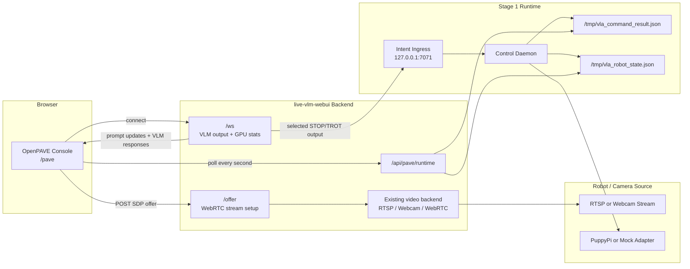

# OpenPAVE Stage 2 Installation and Validation Steps

This guide installs and validates the Stage 2 lightweight OpenPAVE console.

Stage 2 covers:

- Stage 2A: lightweight OpenPAVE UI prototype
- Stage 2B: Stage 1 robot state and command result feedback integration

## Stage 2 Flow



The expected runtime path is:

```text
Browser /pave
-> live-vlm-webui backend
-> existing video backend and WebSocket paths
-> Stage 1 command result and robot state files
-> /api/pave/runtime
-> OpenPAVE console feedback panels
```

## 0. Clone and Initialize Submodules

For a fresh checkout:

```bash
git clone --recurse-submodules https://github.com/odincodeshen/OpenPAVE.git
cd OpenPAVE
```

If the repo was cloned without submodules:

```bash
git submodule update --init --recursive
```

Verify the UI submodule points to the Stage 2 console version:

```bash
git submodule status
git -C ui describe --tags --always
```

Expected:

```text
openpave-stage2-console-v0.1
```

If the tag is missing locally, fetch tags inside the submodule:

```bash
git -C ui fetch --tags origin
git -C ui describe --tags --always
```

## 1. Prepare the Development Environment

Use Python 3.10 to 3.12 for the repo-level virtual environment.

On the DGX/control machine:

```bash
cd /path/to/OpenPAVE
python3.12 -m venv .venv
source .venv/bin/activate
python3 -m pip install -U pip
python3 -m pip install -r intent-ingress/requirements.txt
python3 -m pip install -r ui/requirements.txt
python3 -m pip install -e ui
```

If `python3.12` is not available, use a supported local Python:

```bash
python3 --version
```

Avoid very new Python versions if UI dependencies such as `av` do not provide prebuilt wheels.

Re-run the UI install commands after updating the `ui` submodule to a new commit or tag:

```bash
git submodule update --init --recursive
source .venv/bin/activate
python3 -m pip install -r ui/requirements.txt
python3 -m pip install -e ui
```

`python3 -m pip install -e ui` installs the local `live-vlm-webui` package in editable mode, so the repo-level `.venv` uses the checked-out `ui` submodule code and package data.

Run tests:

```bash
python3 -B -m unittest discover
```

Expected:

```text
OK
```

## 2. Optional: Start Stage 1 Runtime

Stage 2 can open without Stage 1 running, but the command result and robot state panels will show no data until Stage 1 writes feedback files.

For full validation, start Stage 1 first by following:

```text
docs/stage1.step.md
```

At minimum, make sure these files are produced by the control daemon:

```text
/tmp/vla_command_result.json
/tmp/vla_robot_state.json
```

## 3. Terminal 1: Start Intent Ingress

Skip this section if Stage 1 is already running.

```bash
cd /path/to/OpenPAVE
source .venv/bin/activate

export INTENT_PATH=/tmp/vla_intent.json

python3 intent-ingress/intent_ingress.py
```

Health check from another terminal:

```bash
curl -i http://127.0.0.1:7071/healthz
```

Expected:

```text
HTTP/1.1 200 OK

ok
```

## 4. Terminal 2: Start the Control Daemon

For physical PuppyPi validation:

```bash
cd /path/to/OpenPAVE
source .venv/bin/activate

export ROS_DOMAIN_ID=0
export RMW_IMPLEMENTATION=rmw_fastrtps_cpp
export ROBOT_ADAPTER=puppypi

export ROS_SVC_IMAGE=ros:humble
export ROS_PUB_IMAGE=puppy-ros2-cli:humble

export INTENT_PATH=/tmp/vla_intent.json
export COMMAND_RESULT_PATH=/tmp/vla_command_result.json
export ROBOT_STATE_PATH=/tmp/vla_robot_state.json

python3 control-daemon/pave_control_daemon_mvp.py
```

For UI-only local validation without robot hardware:

```bash
cd /path/to/OpenPAVE
source .venv/bin/activate

export ROBOT_ADAPTER=mock
export INTENT_PATH=/tmp/vla_intent.json
export COMMAND_RESULT_PATH=/tmp/vla_command_result.json
export ROBOT_STATE_PATH=/tmp/vla_robot_state.json

python3 control-daemon/pave_control_daemon_mvp.py
```

## 5. Terminal 3: Start a vLLM Backend

Stage 2 can validate layout, WebSocket connectivity, metrics, and Stage 1 feedback without a running VLM backend. Start vLLM when you want to validate real VLM responses in the console.

Start vLLM in its own environment or container. Do not install vLLM into the OpenPAVE repo-level `.venv` unless that is your deployment choice.

Example:

```bash
vllm serve <vision-language-model> \
  --host 0.0.0.0 \
  --port 8000
```

For older vLLM installs that do not provide `vllm serve`, use the OpenAI-compatible API server entry point:

```bash
python3 -m vllm.entrypoints.openai.api_server \
  --host 0.0.0.0 \
  --port 8000 \
  --model <vision-language-model>
```

Verify the OpenAI-compatible endpoint:

```bash
curl -s http://127.0.0.1:8000/v1/models
```

The Stage 2 UI server should use the matching API base:

```text
http://localhost:8000/v1
```

## 6. Terminal 4: Start the Stage 2 UI Server

Start the existing `live-vlm-webui` backend from the OpenPAVE repo.

For HTTP local validation:

```bash
cd /path/to/OpenPAVE
source .venv/bin/activate

export COMMAND_RESULT_PATH=/tmp/vla_command_result.json
export ROBOT_STATE_PATH=/tmp/vla_robot_state.json

HOME=/tmp python3 -B -m live_vlm_webui.server \
  --host 0.0.0.0 \
  --port 8090 \
  --model <vision-language-model> \
  --api-base http://localhost:8000/v1 \
  --api-key EMPTY \
  --no-ssl
```

If you did not install the UI package with `python3 -m pip install -e ui`, use `PYTHONPATH=ui/src`:

```bash
HOME=/tmp PYTHONPATH=ui/src python3 -B -m live_vlm_webui.server \
  --host 0.0.0.0 \
  --port 8090 \
  --model <vision-language-model> \
  --api-base http://localhost:8000/v1 \
  --api-key EMPTY \
  --no-ssl
```

For webcam access from a browser, use HTTPS instead of `--no-ssl`. The upstream UI server can auto-generate local certificates when OpenSSL is available.

Expected startup output includes:

```text
Access the server at:
  Local:   http://localhost:8090
```

## 7. Open the Stage 2 Console

Open:

```text
http://<host>:8090/pave
```

The original Live VLM UI remains available at:

```text
http://<host>:8090/
```

Expected Stage 2 console sections:

- live stream
- stream status
- CPU usage
- memory usage
- GPU usage when available
- GPU memory usage when available
- prompt input
- active model and backend endpoint
- raw VLM result
- parsed intent
- command result
- robot state

## 8. Verify Stage 2 HTTP Endpoints

From another terminal:

```bash
curl -i http://127.0.0.1:8090/pave
```

Expected:

```text
HTTP/1.1 200 OK
```

Check Stage 1 feedback integration:

```bash
curl -s http://127.0.0.1:8090/api/pave/runtime
```

Expected shape:

```json
{
  "command_result_path": "/tmp/vla_command_result.json",
  "robot_state_path": "/tmp/vla_robot_state.json",
  "command_result": null,
  "robot_state": null
}
```

If Stage 1 is running and has processed a command, `command_result` and `robot_state` should contain JSON objects instead of `null`.

## 9. Verify Runtime Feedback in the Console

Send a command through Intent Ingress:

```bash
curl -s -X POST http://127.0.0.1:7071/intent \
  -H 'Content-Type: application/json' \
  -d '{"text":"STOP"}'
```

Check the files:

```bash
cat /tmp/vla_command_result.json
cat /tmp/vla_robot_state.json
```

Expected command result fields:

```json
{
  "intent": "STOP",
  "status": "completed"
}
```

Expected robot state fields:

```json
{
  "status": "idle"
}
```

In the `/pave` console, the Command Result and Robot State panels should update within about one second.

## 10. Verify Prompt and VLM UI Wiring

In the `/pave` console:

1. Edit the prompt text.
2. Click `Apply Prompt`.
3. Confirm the active prompt is accepted by the WebSocket connection.
4. Start an RTSP or webcam stream.
5. Confirm raw VLM output appears in the VLM Result panel when a VLM backend is available.

If no VLM backend is running at `--api-base`, the page can still validate layout, WebSocket connectivity, metrics, and Stage 1 feedback.

## 11. Pass Criteria

Stage 2 validation passes when:

- `python3 -B -m unittest discover` passes
- the UI submodule resolves to `openpave-stage2-console-v0.1`
- `/pave` returns HTTP 200
- `/api/pave/runtime` returns HTTP 200
- the original `/` Live VLM UI still returns HTTP 200
- vLLM is reachable at `/v1/models` when validating real VLM inference
- the `/pave` console shows live stream controls and compact metrics panels
- the prompt can be updated through the existing WebSocket path
- Stage 1 command result and robot state feedback appear in the console
- the UI uses the existing video backend rather than a new stream pipeline

## 12. Debug Checklist

If `/pave` does not open:

```bash
curl -i http://127.0.0.1:8090/pave
lsof -nP -iTCP:8090 -sTCP:LISTEN
```

If `/api/pave/runtime` returns `null` feedback:

```bash
cat /tmp/vla_command_result.json
cat /tmp/vla_robot_state.json
```

Then check:

- control daemon terminal logs
- `COMMAND_RESULT_PATH`
- `ROBOT_STATE_PATH`
- whether Stage 1 has processed at least one command

If the UI server fails to import dependencies:

```bash
source .venv/bin/activate
python3 -m pip install -r ui/requirements.txt
python3 -m pip install -e ui
```

If `av` or other UI dependencies fail to install, recreate `.venv` with Python 3.10 to 3.12.

If VLM results do not appear:

```bash
curl -s http://127.0.0.1:8000/v1/models
```

Then check:

- vLLM process logs
- the model name passed to `--model`
- the UI server `--api-base`
- firewall or container port mapping for port `8000`
